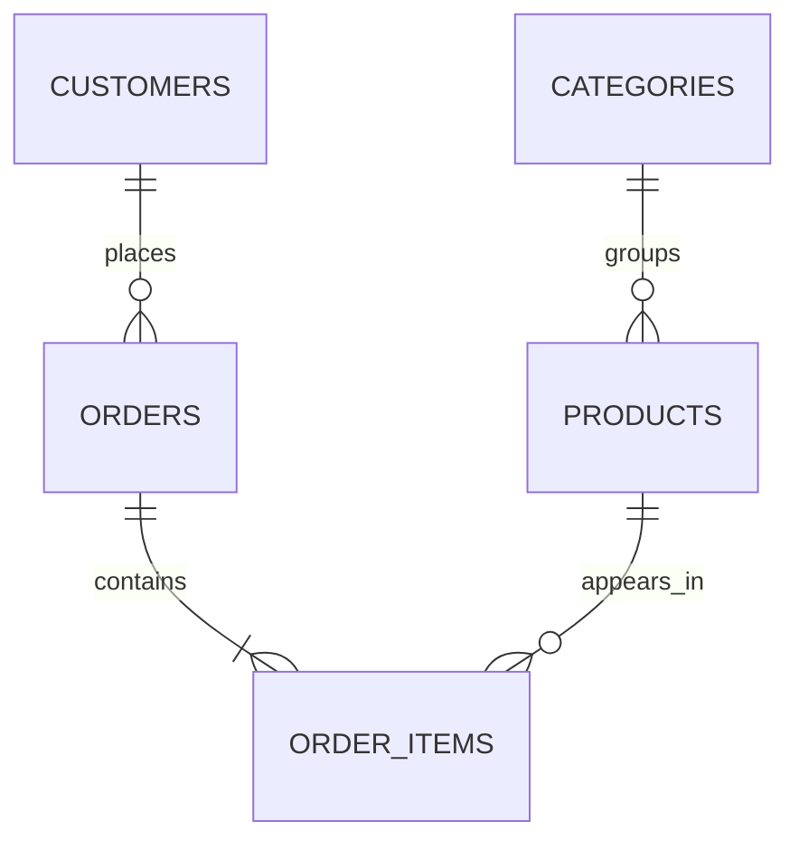

# RetailPulse — PostgreSQL E-commerce Analytics

RetailPulse is an end-to-end PostgreSQL analytics project that models an
e-commerce business and transforms transactional data into customer, product,
category, revenue and profitability insights.

## Project highlights

- Normalized five-table relational data model
- Automated database setup and repeatable data loading
- Eight business-focused analytics queries
- Customer lifetime value and repeat-purchase analysis
- Product and category profitability analysis
- Data-quality tests, indexes and reusable SQL views
## Data model

## Business questions answered

- Which products generate the most revenue?
- Which categories produce the highest gross margins?
- Who are the most valuable customers?
- What is the average order value?
- How does revenue change month by month?
- What percentage of customers make repeat purchases?
- Which products perform best within each category?
- How much discounting affects product profitability?




```text
customers 1 ─── many orders
orders    1 ─── many order_items
products  1 ─── many order_items
categories 1 ── many products
```

## Project structure

```text
retailpulse_sql_complete/
├── sql/
│   ├── ddl/          # Schema, tables, indexes and views
│   ├── seed/         # Repeatable sample data
│   ├── analytics/    # Business-analysis queries
│   └── tests/        # Data-quality checks
├── scripts/          # Setup, reset, analytics and test runners
├── docs/             # Learning notes and Git workflow
├── Makefile
├── environment.yml
└── README.md
```

## Quick start

You need a running PostgreSQL server and the `psql` and `createdb` commands.

```bash
cd retailpulse_sql_complete
chmod +x scripts/*.sh
./scripts/setup_database.sh retailpulse
```

Run the analytics:

```bash
./scripts/run_analytics.sh retailpulse
```

Run the data-quality checks:

```bash
./scripts/run_tests.sh retailpulse
```

You can also use:

```bash
make setup
make analytics
make test
```

## Manual execution order

```bash
psql retailpulse -f sql/ddl/001_create_schema.sql
psql retailpulse -f sql/ddl/002_create_customers.sql
psql retailpulse -f sql/ddl/003_create_categories.sql
psql retailpulse -f sql/ddl/004_create_products.sql
psql retailpulse -f sql/ddl/005_create_orders.sql
psql retailpulse -f sql/ddl/006_create_order_items.sql
psql retailpulse -f sql/ddl/007_create_indexes.sql
psql retailpulse -f sql/ddl/008_create_views.sql

psql retailpulse -f sql/seed/001_seed_customers.sql
psql retailpulse -f sql/seed/002_seed_categories.sql
psql retailpulse -f sql/seed/003_seed_products.sql
psql retailpulse -f sql/seed/004_seed_orders.sql
psql retailpulse -f sql/seed/005_seed_order_items.sql
```

## Analytics included

1. Revenue by order
2. Top-selling products
3. Category performance
4. Customer lifetime value
5. Monthly revenue
6. Repeat-purchase rate
7. Product margin analysis
8. Product ranking within category

## Important modelling decisions

`order_items` resolves the many-to-many relationship between orders and
products. Its `unit_price` stores the historical price charged at purchase
time, while `products.unit_price` stores the current catalogue price.

The seed scripts look up customers by email, products by SKU and orders by
order reference instead of assuming generated IDs. This keeps the scripts
portable and repeatable.

## Reset

The reset script deletes the complete `retail` schema and rebuilds it:

```bash
./scripts/reset_database.sh retailpulse
```

It asks for explicit confirmation.

## Suggested Git commands

```bash
git switch -c feature/complete-retailpulse
git add .
git commit -m "feat: complete RetailPulse SQL analytics project"
git push -u origin feature/complete-retailpulse
```

## Portfolio summary

Built a PostgreSQL e-commerce analytics project with a normalized five-table
data model, repeatable data-loading scripts, integrity constraints, reusable
views, indexes and business SQL covering revenue, product performance,
category performance, customer value, retention and margins.
