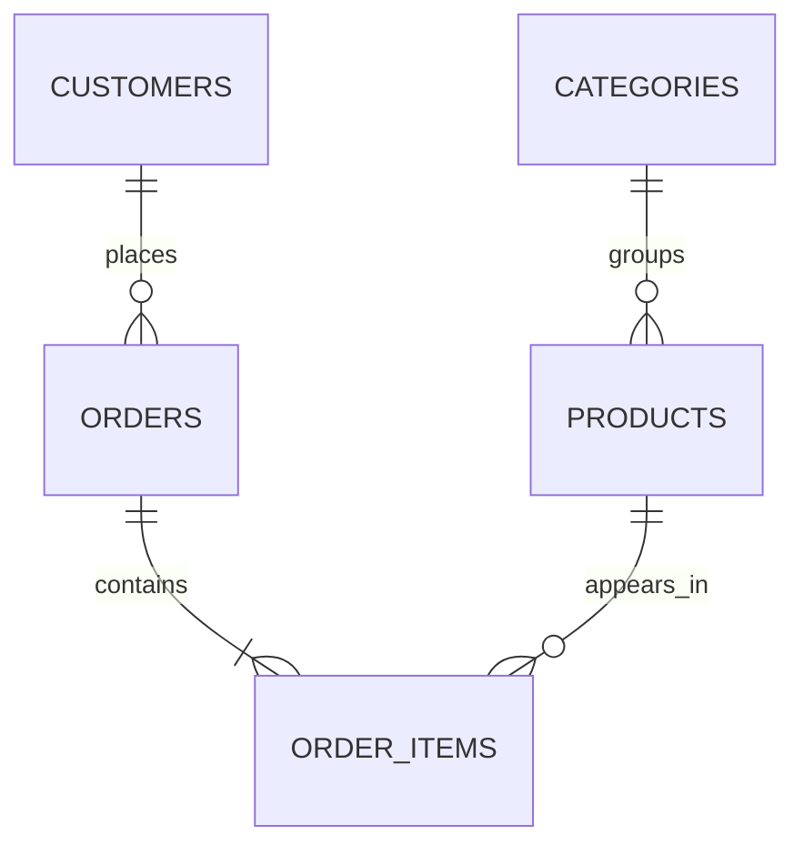

# RetailPulse — PostgreSQL E-commerce Analytics

[](https://github.com/pranjal020496/retailpulse_sql/actions/workflows/sql-ci.yml)


RetailPulse is an end-to-end PostgreSQL analytics project that models an
e-commerce business and transforms transactional data into customer, product,
category, revenue and profitability insights.

## Project highlights

- Normalized five-table relational data model
- Automated database setup and repeatable data loading
- Eight business-focused analytics queries
- Customer lifetime value and repeat-purchase analysis
- Product and category profitability analysis
- Data-quality tests, indexes and reusable SQL views

## Business questions answered

- Which products generate the most revenue?
- Which categories produce the highest gross margins?
- Who are the most valuable customers?
- What is the average order value?
- How does revenue change month by month?
- What percentage of customers make repeat purchases?
- Which products perform best within each category?
- How much discounting affects product profitability?

## Data model



```text
customers 1 ─── many orders
orders    1 ─── many order_items
products  1 ─── many order_items
categories 1 ── many products
```
## Results Snapshot

The following results were generated from the version-controlled sample data
included in this repository.

Revenue metrics include valid sales orders used by the analytics queries. The
dataset contains 12 total orders, of which 10 contribute to the reported sales
metrics.

### Dataset overview

| Metric | Value |
|---|---:|
| Customers | 8 |
| Product categories | 5 |
| Products | 12 |
| Total orders | 12 |
| Order items | 22 |
| Valid sales orders | 10 |
| Valid-order revenue | 1,877.68 |
| Average valid order value | 187.77 |

### Customer metrics

| Metric | Result |
|---|---:|
| Purchasing customers | 6 |
| Repeat customers | 3 |
| Repeat-purchase rate | 50.00% |

### Top products by net revenue

| Rank | Product | Units sold | Net revenue | Gross profit |
|---:|---|---:|---:|---:|
| 1 | Mechanical Keyboard | 3 | 339.97 | 144.97 |
| 2 | Wireless Headphones | 3 | 269.97 | 134.97 |
| 3 | Ergonomic Office Chair | 1 | 229.99 | 84.99 |
| 4 | SQL Fundamentals | 5 | 214.95 | 114.95 |
| 5 | Cotton T-Shirt | 5 | 144.95 | 84.95 |

### Category performance

| Category | Orders | Units sold | Net revenue | Gross profit | Gross margin |
|---|---:|---:|---:|---:|---:|
| Electronics | 7 | 7 | 679.93 | 311.93 | 45.88% |
| Books | 4 | 7 | 319.93 | 171.93 | 53.74% |
| Home | 2 | 2 | 299.98 | 120.98 | 40.33% |
| Fashion | 2 | 6 | 279.94 | 139.94 | 49.99% |
| Sports | 2 | 3 | 259.97 | 121.97 | 46.92% |

### Monthly revenue

| Month | Valid orders | Revenue | Average order value |
|---|---:|---:|---:|
| January 2026 | 2 | 289.95 | 144.98 |
| February 2026 | 2 | 233.93 | 116.97 |
| March 2026 | 1 | 356.97 | 356.97 |
| April 2026 | 1 | 219.98 | 219.98 |
| May 2026 | 2 | 416.91 | 208.46 |
| June 2026 | 2 | 359.94 | 179.97 |

### Key findings

- **Electronics was the strongest category**, generating 679.93 in net
  revenue and 311.93 in gross profit.
- **Books achieved the highest gross margin at 53.74%**, despite generating
  less revenue than Electronics.
- **Mechanical Keyboard was the highest-revenue product**, producing 339.97
  in net revenue and 144.97 in gross profit.
- **SQL Fundamentals and Cotton T-Shirt jointly led unit sales**, with five
  units sold each.
- **May 2026 was the strongest revenue month**, generating 416.91 from two
  valid orders.
- **March had the highest average order value at 356.97**, driven by one
  comparatively large order.
- **Half of all purchasing customers were repeat customers**, resulting in a
  repeat-purchase rate of 50.00%.


## Project structure

```text
retailpulse_sql/
├── sql/
│   ├── ddl/          # Schema, tables, indexes and views
│   ├── seed/         # Repeatable sample data
│   ├── analytics/    # Business-analysis queries
│   └── tests/        # Data-quality checks
├── scripts/          # Setup, reset, analytics and test runners
├── docs/             # Learning notes and Git workflow
├── Makefile
├── environment.yml
└── README.md
```

## Quick start

You need a running PostgreSQL server and the `psql` and `createdb` commands.

```bash
cd retailpulse_sql
chmod +x scripts/*.sh
./scripts/setup_database.sh retailpulse
```

Run the analytics:

```bash
./scripts/run_analytics.sh retailpulse
```

Run the data-quality checks:

```bash
./scripts/run_tests.sh retailpulse
```

You can also use:

```bash
make setup
make analytics
make test
```

## Manual execution order

```bash
psql retailpulse -f sql/ddl/001_create_schema.sql
psql retailpulse -f sql/ddl/002_create_customers.sql
psql retailpulse -f sql/ddl/003_create_categories.sql
psql retailpulse -f sql/ddl/004_create_products.sql
psql retailpulse -f sql/ddl/005_create_orders.sql
psql retailpulse -f sql/ddl/006_create_order_items.sql
psql retailpulse -f sql/ddl/007_create_indexes.sql
psql retailpulse -f sql/ddl/008_create_views.sql

psql retailpulse -f sql/seed/001_seed_customers.sql
psql retailpulse -f sql/seed/002_seed_categories.sql
psql retailpulse -f sql/seed/003_seed_products.sql
psql retailpulse -f sql/seed/004_seed_orders.sql
psql retailpulse -f sql/seed/005_seed_order_items.sql
```

## Analytics included

1. Revenue by order
2. Top-selling products
3. Category performance
4. Customer lifetime value
5. Monthly revenue
6. Repeat-purchase rate
7. Product margin analysis
8. Product ranking within category

## Important modelling decisions

`order_items` resolves the many-to-many relationship between orders and
products. Its `unit_price` stores the historical price charged at purchase
time, while `products.unit_price` stores the current catalogue price.

The seed scripts look up customers by email, products by SKU and orders by
order reference instead of assuming generated IDs. This keeps the scripts
portable and repeatable.

## Reset

The reset script deletes the complete `retail` schema and rebuilds it:

```bash
./scripts/reset_database.sh retailpulse
```

It asks for explicit confirmation.


## Portfolio summary

Built a PostgreSQL e-commerce analytics project with a normalized five-table
data model, repeatable data-loading scripts, integrity constraints, reusable
views, indexes and business SQL covering revenue, product performance,
category performance, customer value, retention and margins.
